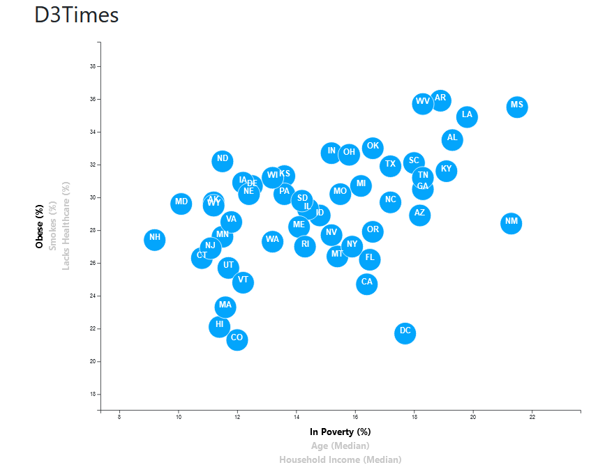
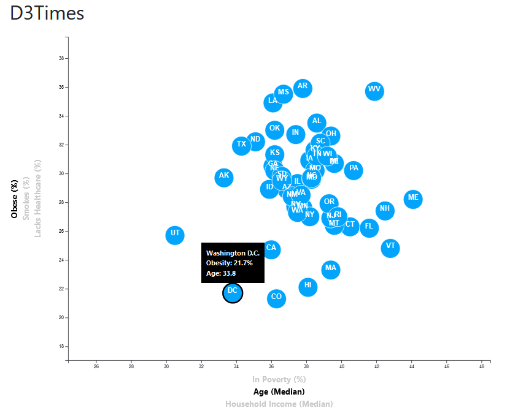
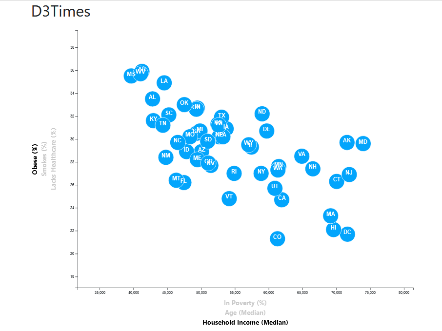
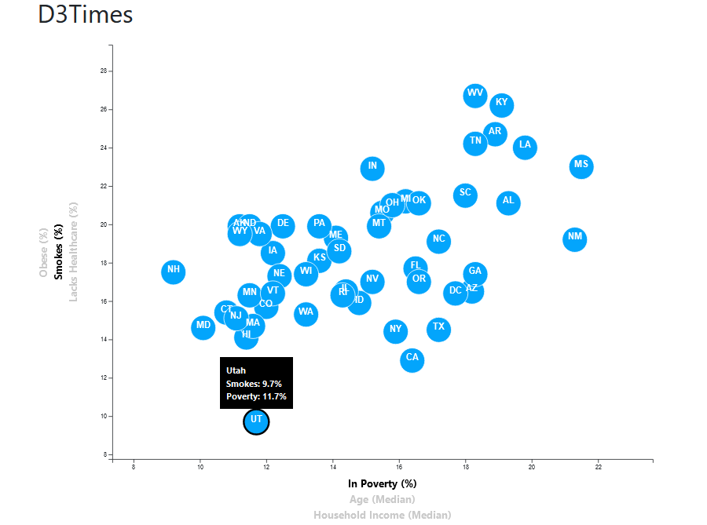
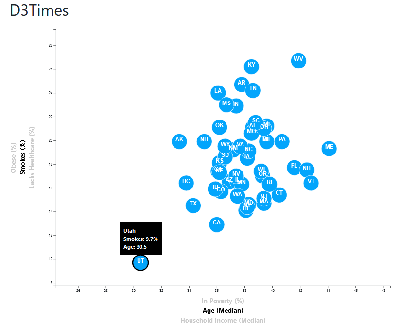
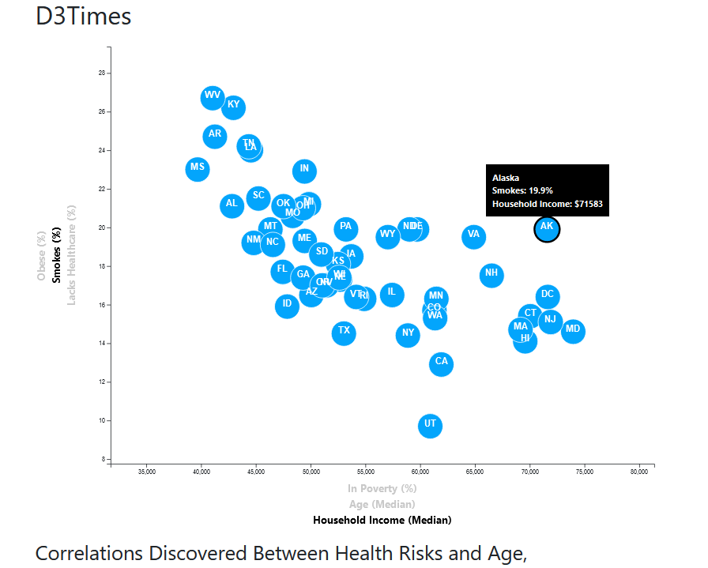
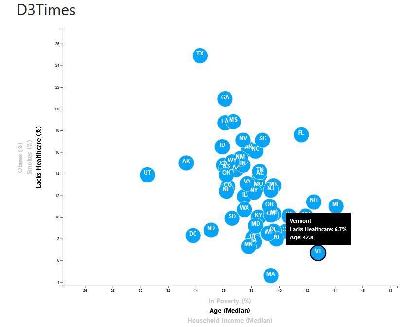
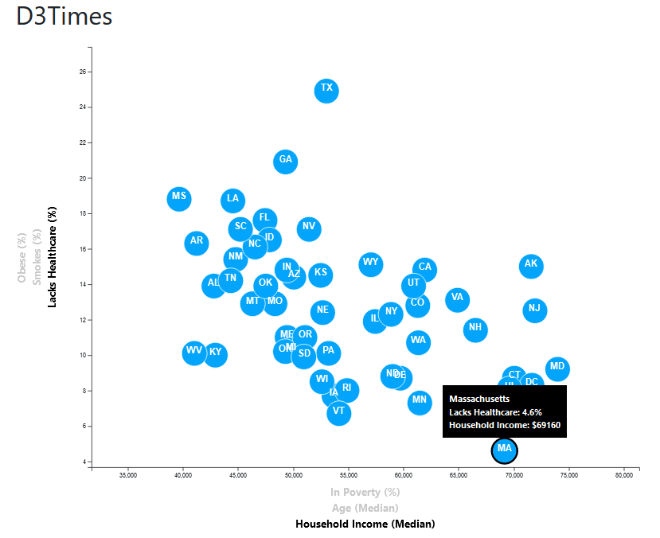

# Data Journalism

This respository contains a webpage which uses D3.js create an interactive scatterplot of demographics for all 50 US states.

Data can be compared across 6 different demographic criteria

### Obsesity vs Poverty

 

### Obsesity vs age

 

### Obsesity vs Household Income

 

### Smoking vs Poverty

 

### Smoking vs age

 

### Smoking vs Household Income

 

### Lack of Heathcare vs Poverty

 

### Lack of Heathcare vs age

 

### Lack of Heathcare vs Household Income

 

## Tools/Packages
- HTML
- CSS
- Javascript
  - D3.js

 

## How to use
- Download the respository
- Go the the **D3_data_journalism** folder
- Open Git Bash in the directory and type `python -m http.server` to launch the python server, then go to your local host, e.g `localhost:8000`.
